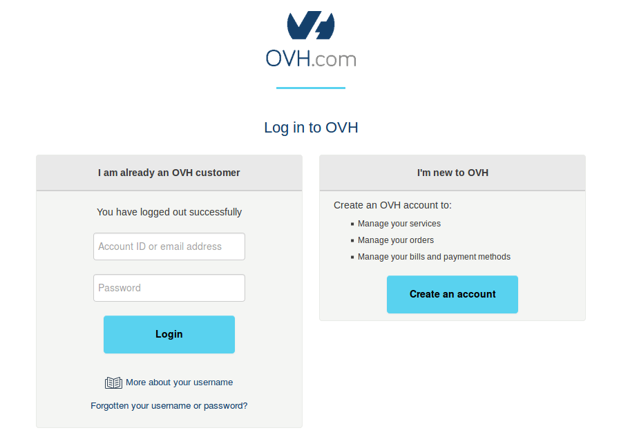
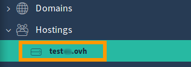
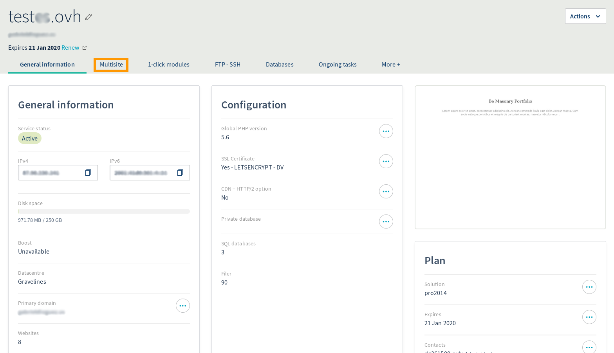
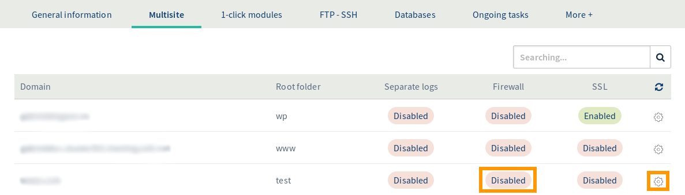
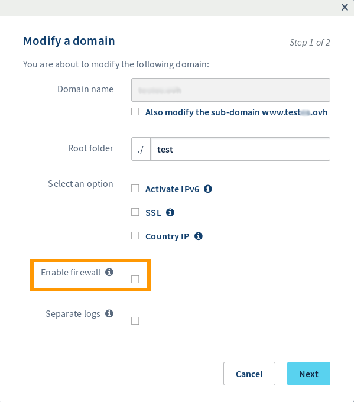
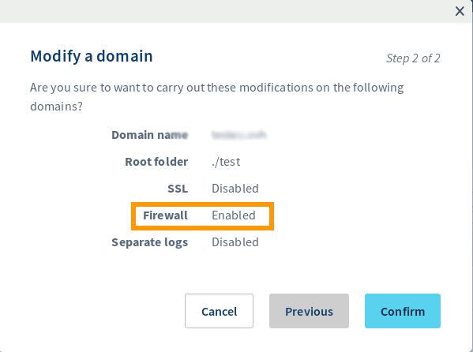

**Last updated 4th June 2019**

##  Objective

This complementary Apache module filters all incoming requests on your web servers. To increase security, it intercepts and checks them before they are processed by the scripts. 

Enable ModSecurity in one click from your control panel to get enhanced protection.

With the Core Rule Set (CRS), your ModSecurity is preconfigured in an optimal way straight away, protecting you against the most common attacks: 

- Trojan
- Email injections
- Broken PDF files
- File injections on your hosting system
- SQL or XSS type injections
- etc.

## Requirements 

- You must have an [OVH Web Hosting plan](https://www.ovh.co.uk/web-hosting/){.external}.
- You must be logged in to your [OVH Control Panel](https://www.ovh.com/auth/?action=gotomanager){.external}.

## Instructions

{.thumbnail}

- **Select your domain name in the "Hostings" section.**

{.thumbnail}

- **Click on the "Multisite" tab.**

{.thumbnail}

- **Firewall is Disabled by default. Click on the gear icon to access your hosting package options.**

{.thumbnail}

- **Check "Enable firewall" > Next.**

{.thumbnail}

- **You will see a summary of changes, and the firewall status should have changed to enabled/activated. Click confirm.**

{.thumbnail}

- **The firewall is now enabled on your hosting package.**

{.thumbnail}

