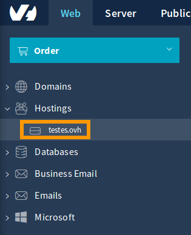
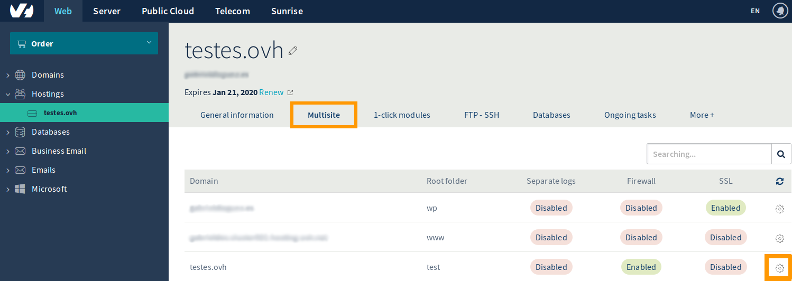

**Last updated 4th June 2019**

## Objective

This guide will take you through the steps you need to take to activate geolocation for your website from your [OVH control panel](https://www.ovh.com/manager/).

## Instructions

Once you are logged on, click on the name of your main website under the Hostings section.

{.thumbnail}

In the menu, select the Multisite tab.
Then click on the gear icon of the site that you wish to geolocate.

{.thumbnail}

First, check "Country IP" box, then you will be able to choose the IP for the country in question in the drop-down list.
OVH can offer 12 different country IPs

{.thumbnail}

In step 2 of the process, you will see a summary of the actions taken. To finish, press "Confirm".

This change will take up to 24 hours to take effect. 

{.thumbnail}

